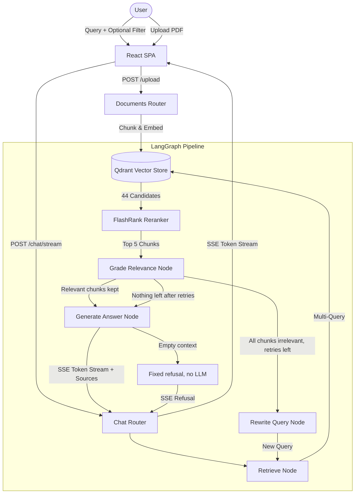

# RAG Legal Assistant

An agentic Retrieval-Augmented Generation (RAG) system for querying Polish legal acts. Built with LangGraph, FastAPI, and React, it features a self-corrective retrieval pipeline, real-time Server-Sent Events (SSE) streaming, cross-encoder reranking, and dynamic document upload.

Retrieval configuration was chosen by measurement, not intuition — see [Performance & Evaluation](#performance--evaluation) and the full benchmark in [`benchmarks/retrieval.md`](benchmarks/retrieval.md).

## Features

### Self-Corrective Retrieval Pipeline
- Implemented as a state machine via **LangGraph**.
- The pipeline does not blindly trust retrieved documents. An LLM-as-a-Judge grades each retrieved chunk against the query and drops the irrelevant ones.
- If every chunk is dropped, a Rewriter node reformulates the query and triggers a new retrieval cycle, up to `MAX_QUERY_REWRITES` (default 3).
- If nothing survives grading after those retries, the generator **does not call the LLM**. It returns a fixed refusal instead of answering from the model's parametric knowledge — which, without this guard, invents a statute and cites it as a source.

### Retrieval Architecture
- **Semantic Search**: Qdrant vector database, 512-character chunks, Polish sentence-transformer embeddings.
- **Cross-Encoder Reranking**: **FlashRank** re-scores candidates before they reach the LLM. Measured effect on the same candidate set: Hit Rate@5 rises from `0.400` to `0.667` for 39 ms per query.
- **Multi-Query Retrieval**: Generates three Polish paraphrases of the query and searches with all of them plus the original. At a matched candidate budget this lifts recall from `0.789` to `0.844`, at a cost of ~1.5 s and one extra LLM call.
- **Metadata Filtering**: Narrows the search space to a user-selected document, preventing cross-document contamination.

### Dynamic Knowledge Base & Citations
- **In-browser PDF Upload**: Uploaded PDFs are parsed, chunked, embedded, and indexed into Qdrant on the fly. Point IDs are deterministic UUIDs derived from `(source, chunk_index)`, so re-indexing a document is idempotent and never overwrites another document's chunks.
- **Source Citations Panel**: The frontend displays source document, chunk text, and reranker relevance score for every chunk used in the answer.

### Real-Time Streaming
- Fully asynchronous FastAPI backend organized with `APIRouter`.
- Server-Sent Events via LangGraph's `astream_events` (v2) stream retrieved sources first, then the answer token by token.

## Performance & Evaluation

Two separate evaluations, with deliberately different levels of confidence.

### Retrieval quality — n=90, deterministic

The primary benchmark. 90 questions generated from the indexed corpus (one per randomly sampled article, stratified across five legal acts, LLM-validated), each with a known target article. A hit means the chunk that starts the correct article of the correct act appears in the top 5. No LLM judges the result, so the metric is reproducible.

| Configuration | Hit Rate@5 | MRR@5 | Reranking p50 |
|---|---|---|---|
| **multi-query + FlashRank TinyBERT** (production) | **0.667** | **0.485** | 0.039s |
| dense k=44 + FlashRank TinyBERT | 0.611 | 0.463 | 0.042s |
| multi-query, no reranking | 0.400 | 0.321 | — |
| multi-query + `ms-marco-MultiBERT-L-12` | 0.311 | 0.178 | 1.614s |

Two results were worth the effort of measuring, because both contradicted a reasonable prior:

- **The multilingual reranker is worse than no reranker at all** on this Polish corpus, losing to the 4 MB English `ms-marco-TinyBERT-L-2-v2` by 35 points of Hit Rate while being 40× slower. The lexical signal that matters here — article numbers, Latin-rooted legal terminology, proper nouns — apparently survives the language gap better than a quantized mBERT survives compression.
- **`BAAI/bge-reranker-base` does not pay off on CPU**, trailing TinyBERT by 10 points at 56× the latency. On a 38-question set it had looked marginally better; expanding to 90 reversed the ordering, which is a fair reminder of how little a small eval set proves.

Recall of the candidate set caps out at `0.844`, so ranking still loses 18 points of what retrieval already found. The full 12-configuration grid, limitations, and reproduction steps are in [`benchmarks/retrieval.md`](benchmarks/retrieval.md).

### End-to-end answer quality — n=4, exploratory

A **RAGAS** smoke test with LLM-as-a-Judge, on a hand-written 4-question ground-truth set:

| Metric | Score |
|---|---|
| Faithfulness | 0.94 |
| Answer Relevancy | 0.85 |
| Context Precision | 0.75 |
| Context Recall | 0.75 |

Four questions is far too few to draw conclusions from — a single item moves any of these metrics by 25 points. Treat it as a regression check that the generation stage is grounded and on-topic, not as evidence of accuracy.

### Cost and latency

A single query issues up to 7 LLM calls: one to generate query paraphrases, one per retrieved chunk for grading (5, run concurrently), and one to generate the answer. Grading is the dominant cost and buys the self-correction loop; `dense k=44 + TinyBERT` reaches 92% of the production Hit Rate in ~70 ms of retrieval if that trade is not worth it.

## Design Decisions

1. **Why LangGraph over standard LangChain chains?**
   LCEL chains are acyclic and cannot express a retry loop. LangGraph allows the grader to reject a context set and route back into retrieval through a rewritten query, with a retry counter in the graph state as the termination guard.
2. **Why Qdrant?**
   Chosen over FAISS for first-class Docker support, a persistent server process, payload filtering used for per-document search, and REST/gRPC APIs that fit a containerized setup.
3. **Why an English reranker for Polish text?**
   Because it measured better. The multilingual alternative was benchmarked and lost decisively; see above.
4. **Why uv?**
   Rust-based dependency resolution cuts Docker build times substantially versus `pip`, and `uv.lock` keeps image builds reproducible.

## Known Limitations

- The RAGAS set is 4 questions. Answer-quality claims are correspondingly weak.
- The retrieval benchmark scores only the chunk that *begins* the target article, so continuation chunks of long articles count as misses. All configurations are penalized equally, but absolute numbers are understated.
- Benchmark questions were generated from the articles they target, so some lexical leakage is possible despite the paraphrase instruction.
- No hybrid (BM25 + dense) retrieval yet. Given that 15.6% of questions never reach the candidate set, exact-match lexical retrieval is the most promising remaining lever.
- The grader prompt is internally inconsistent — it calls itself strict, then grades on a loose “related keywords or meaning” criterion — and in practice resolves that toward strictness. Relevant chunks can be dropped, which is what exhausts the rewrite budget on questions the retriever actually answered.
- The rewriter takes the already-rewritten query as input, not the original, so the loop can drift semantically (e.g. “limitation period” → “maximum limitation period”) instead of converging. Fixing either of the last two points would change retrieval behaviour and invalidate the published benchmark; they stay until the 90-question set is re-run.
- The unit test suite covers the deterministic parts of the pipeline (chunking, article parsing, ranking metric, point IDs, and the empty-context refusal). Answer quality is still verified only by the benchmarks above, not by tests.

## Tech Stack

| Layer | Technologies                                                                 |
|---|------------------------------------------------------------------------------|
| **Backend** | FastAPI, APIRouter, Python 3.12, uv, pytest                                  |
| **Vector Database** | Qdrant                                                                       |
| **Orchestration** | LangGraph, LangChain                                                         |
| **Reranking** | FlashRank (`ms-marco-TinyBERT-L-2-v2`)                                       |
| **LLM & Embeddings** | OpenAI (gpt-4o-mini), HuggingFace (`sdadas/st-polish-paraphrase-from-mpnet`) |
| **Evaluation** | RAGAS, custom retrieval harness (Hit Rate@k, MRR@k)                          |
| **Frontend** | React 19, Vite, TypeScript, Tailwind CSS                                     |
| **Deployment** | Docker, Docker Compose (with local HF and reranker cache volumes)            |

## Architecture



## Getting Started

### Prerequisites
- Docker and Docker Compose
- An OpenAI API key

### Installation and Execution

1. Clone the repository:
   ```bash
   git clone https://github.com/YOUR_USERNAME/rag-legal-assistant.git
   cd rag-legal-assistant
   ```

2. Copy the example environment file and fill in your OpenAI API key. Everything else has a working default; see the comments in `.env.example`.
   ```powershell
   Copy-Item .env.example .env
   ```

3. Build and run the containers:
   ```bash
   docker compose up --build -d
   ```
   *On the first run the embedding and reranker models are downloaded into the `./hf_cache` and `./model_cache` volumes so they persist across restarts.*

The orchestration spins up three services:
- **Qdrant**: `http://localhost:6333`
- **FastAPI Backend**: `http://localhost:8000` (interactive docs at `/docs`)
- **React Frontend**: `http://localhost:5173`

Navigate to `http://localhost:5173` to interact with the assistant.

### Reproducing the retrieval benchmark

```bash
docker compose exec api uv run --no-sync python scripts/build_eval_set.py
docker compose exec api uv run --no-sync python scripts/run_retrieval_eval.py
```

### Tests

Unit tests need neither Qdrant nor an OpenAI key:

```powershell
docker compose exec api uv run --no-sync pytest -m "not integration"
```

Integration tests hit the running API and require Qdrant, an indexed corpus, and an OpenAI key:

```powershell
docker compose exec api uv run --no-sync pytest -m integration
```

## License

MIT
