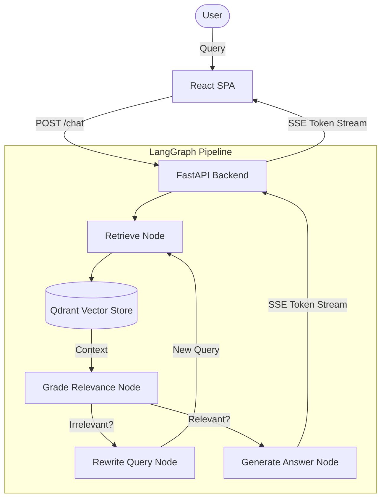

# RAG Legal Assistant

An advanced, agentic Retrieval-Augmented Generation (RAG) system specialized in the analysis of Polish civil law. Built with LangGraph, FastAPI, and React, it features a self-corrective retrieval pipeline and real-time Server-Sent Events (SSE) streaming.

## Features

### Self-Corrective Retrieval Pipeline
- Implemented using a state machine via **LangGraph**.
- The pipeline does not blindly trust the retrieved documents. Instead, it utilizes an LLM-as-a-Judge (Grader) to evaluate the relevance of the retrieved context against the user query.
- If the retrieved context is deemed irrelevant, a Rewriter node autonomously reformulates the query and triggers a new retrieval cycle until a satisfactory context is found or a retry limit is reached.

### Advanced RAG Architecture
- **Semantic Search**: Utilizes Qdrant vector database for high-performance similarity search.
- **Polish Language Embeddings**: Employs specialized HuggingFace models (`sdadas/st-polish-paraphrase-from-mpnet`) optimized for Polish legal text embedding.
- **Multi-Query Retrieval**: Automatically generates multiple semantic variants of the user query to maximize context recall and overcome vocabulary mismatch in legal documents.

### Real-Time Streaming
- Fully asynchronous backend built with FastAPI.
- Employs Server-Sent Events (SSE) via LangGraph's `astream_events` (v2) to stream the generated answer token-by-token directly to the React frontend, ensuring a low latency and highly responsive user experience.

### Quantitative Evaluation
- Pipeline accuracy and robustness rigorously evaluated using the **RAGAS** framework.
- Evaluated against a custom ground-truth dataset comprising complex legal scenarios.

## Tech Stack

| Layer | Technologies |
|---|---|
| **Backend** | FastAPI, Uvicorn, Python 3.12, uv |
| **Vector Database** | Qdrant |
| **Orchestration** | LangGraph, LangChain |
| **LLM & Embeddings** | OpenAI (gpt-4o-mini, text-embedding-3-small), HuggingFace |
| **Frontend** | React 19, Vite, TypeScript |
| **Evaluation** | RAGAS, Datasets |
| **Deployment** | Docker, Docker Compose |

## Architecture



## Performance & Evaluation

The system was benchmarked using the **RAGAS** (Retrieval Augmented Generation Assessment) framework utilizing an LLM-as-a-Judge methodology on a dedicated legal dataset.

- **Faithfulness**: `0.9375` (Answers are highly grounded in the retrieved context with minimal hallucination)
- **Answer Relevancy**: `0.8502` (Responses directly address the user's intent)
- **Context Precision**: `0.7500` (Highly relevant documents are ranked at the top of the retrieval results)
- **Context Recall**: `0.7500` (The retrieved context contains the necessary information to answer the query)

## Design Decisions

1. **Why LangGraph over standard LangChain Chains?**
   Standard LCEL chains are linear (DAGs) and do not support cyclic execution. By utilizing LangGraph, the system implements a cyclic, self-correcting loop where poor retrieval results trigger a query rewrite and a subsequent re-retrieval. This significantly improves accuracy on complex legal queries where initial keyword matching often fails.
2. **Why Qdrant?**
   Qdrant was chosen over FAISS for its robust Docker support, production-readiness, and built-in REST/gRPC APIs, allowing for seamless integration into a containerized microservices architecture.
3. **Why uv?**
   `uv` by Astral was selected as the package manager due to its Rust-based dependency resolution, which drastically reduces build times during Docker image construction compared to standard `pip`.

## Getting Started

### Prerequisites
- Docker and Docker Compose
- An OpenAI API key

### Installation and Execution

1. Clone the repository:
   ```bash
   git clone https://github.com/YOUR_USERNAME/rag-legal-assistant.git
   cd rag-legal-assistant
   ```

2. Create a `.env` file in the root directory and add your OpenAI API key:
   ```env
   OPENAI_API_KEY=sk-your-openai-api-key
   ```

3. Build and run the containers using Docker Compose:
   ```bash
   docker compose up --build
   ```

The orchestration spins up three services:
- **Qdrant**: Available at `http://localhost:6333`
- **FastAPI Backend**: Available at `http://localhost:8000` (Interactive API docs at `http://localhost:8000/docs`)
- **React Frontend**: Available at `http://localhost:5173`

Navigate to `http://localhost:5173` in your browser to interact with the Legal Assistant.

## License

MIT
